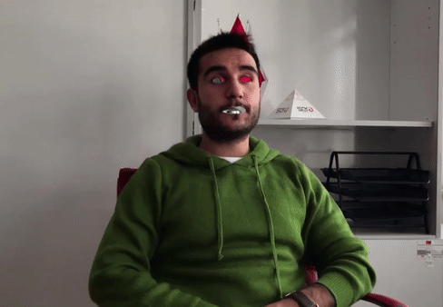

# Invisible Face

All objects in the mask color range to be specified will show the background. For this, it is useful to **take the background blank first**.<br> If desired, objects with colors in the color range can be tested by showing them to the camera. The invisibility cloak is the most popular and known, but here it has been studied on the loss of the human face, eyes and mouth.<br><br>
First of all, face detection is required. Next, the mouth and eyes on the face should be found. Then the color is embedded in them. In this way, the invisibility can be obtained by the color in the mask range.

Actually 2 different projects are presented. *invisible_face* and *invisible_eyes&mouth*. The differences between them are the models used and detection methods. <br>
The simplest method for face detection is as follows. **Haarcascade model**. This is used for the *invisible_face.py*.
``` 
#model
face_cascade = cv2.CascadeClassifier('model\haarcascade_frontalface_alt.xml')

# Detect faces
faces = face_cascade.detectMultiScale(gray, 1.3, 5)

for (x, y, w, h) in faces:
    # To draw a filled rectangle in a face
    # should be choose color in mask range
    cv2.rectangle(img, (x , y ), (x + w , y + h ), (70, 255, 255), -1)
```
Only the haarcascade model is not sufficient in finding the eyes and mouth. Hence; **68 face landmarks**, which can extract 68 different points on the face, will be helpful. It can also take advantage of dlib for face detection. This is used for the *invisible_eyes&mouth.py*.
```
detector = dlib.get_frontal_face_detector()
predictor = dlib.shape_predictor('model/shape_predictor_68_face_landmarks.dat')

rects = detector(gray, 0)
    for rect in rects:

        shape = predictor(gray, rect)
        shape = face_utils.shape_to_np(shape)

        lip = shape[48:60] # lip landmarks values
        eye_left = shape[36:42] # left eye landmarks values
        eye_right = shape[42:48] # right eye landmarks values
```

## Installation
* **Clone** this repository to your local machine using ` https://github.com/aunluhisarcikli/invisible-face.git `

* **Requirements** are :
  * Python
  * OpenCV
  * Numpy <br>
	In addition for invisible eyes and mouth: 
	* dlib
	* imutils


